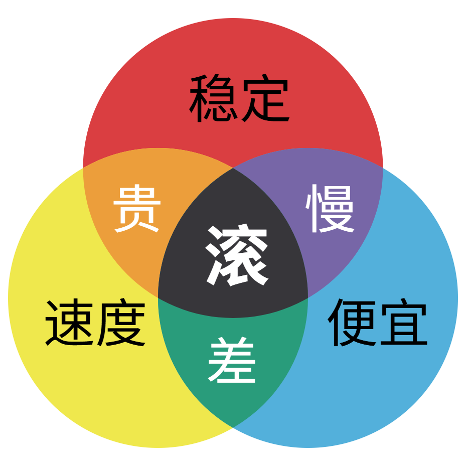
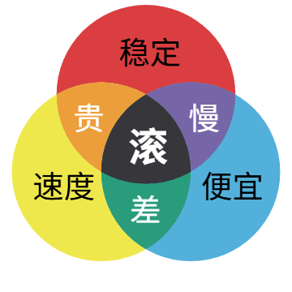

# 三色图制作器

简体中文 | [English](README.en.md)

在线制作「稳定 / 速度 / 便宜」这类三色韦恩图表情包，还能一键生成转圈圈的 GIF 动图。

**在线使用：<https://justlikecheese.github.io/sansetu/>**

| 静态图 | 转圈圈动图 |
| --- | --- |
|  |  |

## 功能

- **默认效果与原图一致**：圆的位置、配色、文字位置和字号都按原图测量还原。
- **颜色、文字全部可改**：七个区域各自的底色、文字、字色、字号、加粗；文字支持换行。
- **圆圈 DIY**：半径、圆心距离、三个圆各自的大小、描边粗细和颜色。
- **文字 DIY**：多种中文字体、整体字号缩放、文字描边；在图上直接拖动文字调整位置，双击文字即可修改。
- **预设**：多套文案（钱多事少离家近、学习睡觉社交……）和配色（马卡龙、霓虹、莫兰迪、黑白、随机），交集颜色可以由三个圆自动混色。
- **多种导出格式**：PNG、JPG、WebP、SVG，可选 0.5x～4x 尺寸，也可以直接复制图片到剪贴板。
- **转圈圈动图**：实时预览，转几圈、方向、时长、停顿、转速曲线（减速停下、急刹车、回弹……）、停下时中心字弹一下 / 蹦出来、文字保持正向、帧率（10～25 帧/秒）、尺寸、是否循环都能调，生成 GIF 表情包直接下载。
- **多语言**：简体中文、繁體中文、English、日本語，按浏览器语言自动选择，每种语言都有自己的默认文案和预设。
- **分享链接**：一键复制带有全部设置的链接，别人打开就是同一张图；修改会自动保存在本地浏览器里。

纯前端实现，没有构建步骤、没有第三方脚本；GIF 编码器是自己写的（`gif.js`）。图片全部在浏览器本地生成，不会上传。

## 本地运行

直接用浏览器打开 `index.html` 即可，或者起一个静态服务器：

```bash
python -m http.server 8000
```

## 文件

- `index.html` / `style.css`：页面与样式
- `app.js`：绘制、交互、导出
- `i18n.js`：界面文案和各语言的文案预设
- `gif.js`：GIF89a 编码器（流行色调色板 + LZW）

## 许可证

[GPL-3.0](LICENSE)
